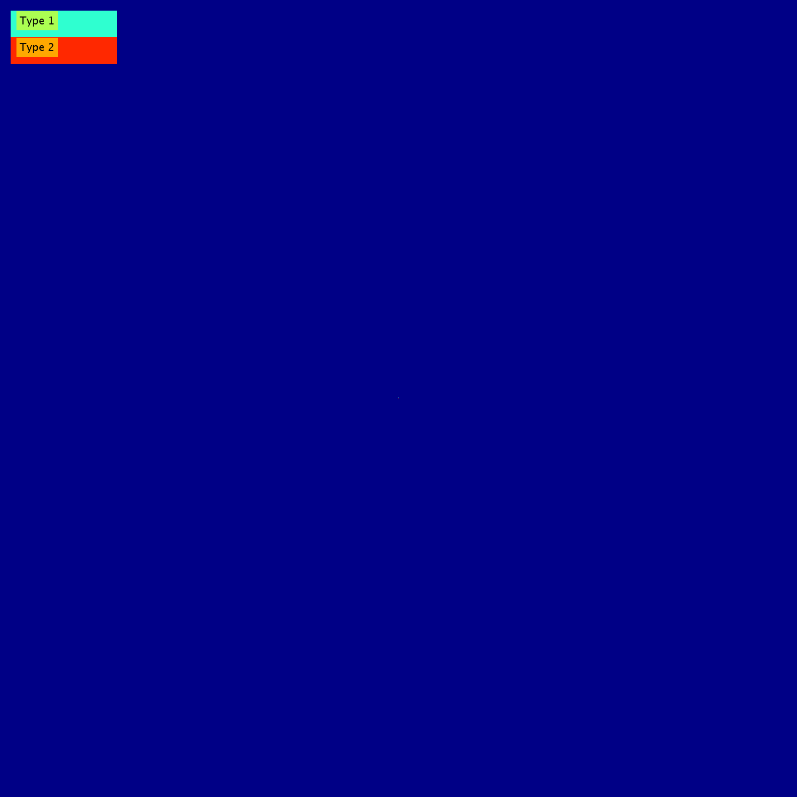

# Enclosed Pattern

We use the following pattern and observe one type of cell is enclosed by another. 

```
maxGrowthRate1	1
maxGrowthRate2	1
excretionRateB	1
diffusion1	0
diffusion2	0
diffusionB	10
yieldB	1
monodConstantB	1
excretionRateA	1
yieldA	1
diffusionA	10
monodConstantA	1
toxicityB	10
toxicityA	1
```

The pattern we observed:


In this pattern, we can see the type 2 is enclosed by type 1. 

The key of this pattern is when we set the diffusion of bacteria to 0. Since the diffusion rate of two type si equal, but the toxicity is different, whether toxicity A > toxicity B, so the growth rate of the type 2 bacteria is circumscribed by the toxicity of nutrient A. Due to this, type 1 is growing faster than type 2. In our configuration, the difference in growth rate is tremendous so that despite that type 2 is growing at beginning, type 1 colonize all the free space around type 2 and form a barricade. Since the diffusion of bacteria is 0, the type 2 cannot escape from the barricade. That why we observed such a pattern.

In another setting, we change the diffusion rate by a little, where we have 

```
maxGrowthRate1	1
maxGrowthRate2	1
excretionRateB	1
diffusion1	1
diffusion2	1
diffusionB	20
yieldB	1
monodConstantB	1
excretionRateA	1
yieldA	1
diffusionA	20
monodConstantA	1
toxicityB	10
toxicityA	1
```

In this scenario, besides that change of diffusion of nutrient, which may have influence on the increment of spreading speed, we noticed that the diffusion of backteria helps them to escape from the barricade built by the dominating type of backteria. Here, we observed the following pattern (very similar to the stripe patter but with dots instead of stripes)



 One thing we are sure at this moment is the significant of the diffusion of backteria helps them to co-exist in mutualism model.

#### Plan

Now, with the above information, we are looking another change of parameters to help two backteria types co-existing.

We will keep the diffusion rate of backteria remaining 0 and the toxicity, which differs the growth rate of two types.

```
diffusion1	0
diffusion2	0
toxicityB	10
toxicityA	1
```

1. We will try different excretion rate

   ```
   excretionRateA	0.1
   excretionRateB	1
   ```

   OR

   ```
   excretionRateA	1
   excretionRateB	0.1
   ```

   

2. We will change the yield rate

   ```
   yieldB	1
   yieldA	0.1
   ```

3. We will change diffution rate of nutrient A larger than diffusion rate of nutrient B

   ```
   diffusionB	1
   diffusionA	10
   ```

   